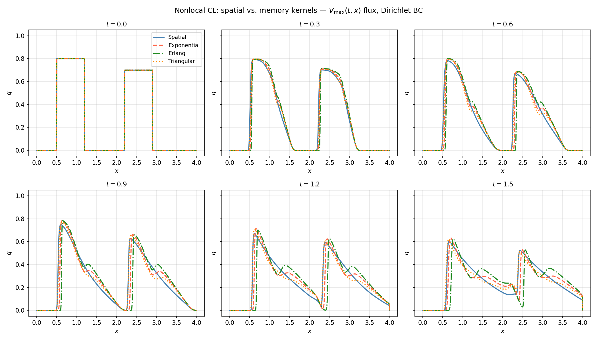
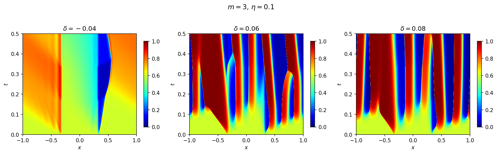
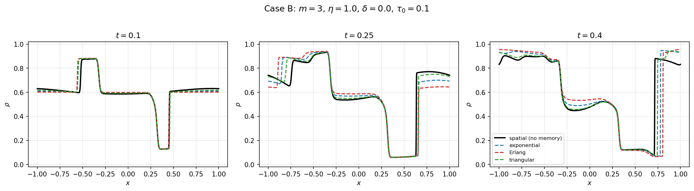
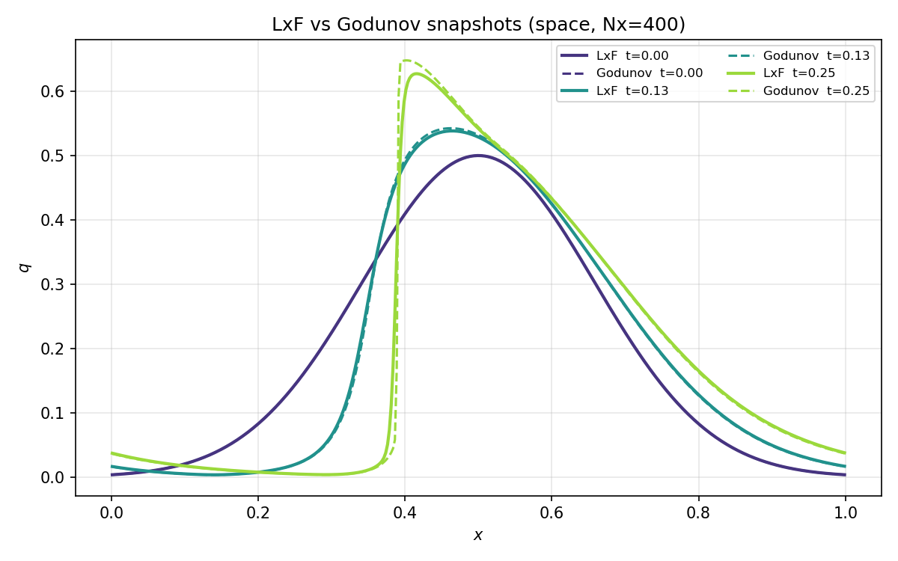
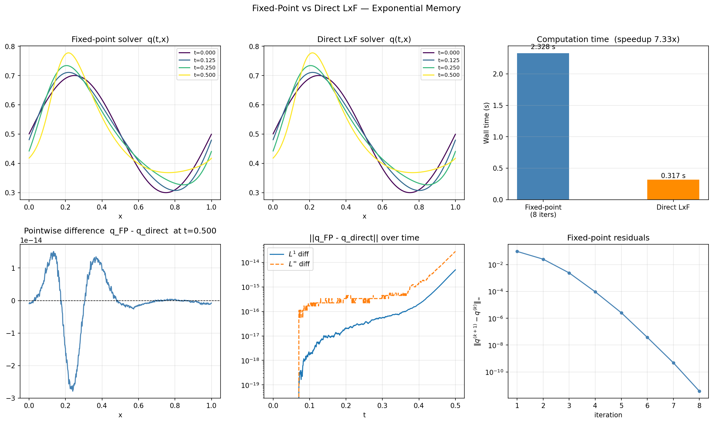

# CLAWS — Conservation Laws with Memory

Numerical companion to the paper:

> **On the existence and uniqueness of nonlocal nonlinear conservation laws by means of fixed-point methods**
> Alexander Keimer (University of Rostock), Hossein Nick Zinat Matin (École Polytechnique), Lorenzo Liverani (FAU Erlangen-Nürnberg)

The primary goal of this codebase is to provide **numerical justification** for the theoretical results established in the paper: existence and uniqueness of solutions to 1D nonlocal scalar conservation laws with space-time (memory) nonlocality, proved via Picard fixed-point methods. The numerical solver mirrors the analytical fixed-point framework exactly, so that convergence of the iteration constitutes direct computational evidence for the contraction argument of the paper. 

---

## Table of Contents

1. [Mathematical Models](#mathematical-models)
2. [Numerical Methods](#numerical-methods)
   - [Picard Fixed-Point Iteration](#picard-fixed-point-iteration)
   - [Lax-Friedrichs Scheme](#lax-friedrichs-scheme)
   - [Godunov Scheme](#godunov-scheme)
   - [Recursive Exponential Accumulator](#recursive-exponential-accumulator)
3. [Project Structure](#project-structure)
4. [Solvers](#solvers)
5. [Experiments](#experiments)
6. [Results](#results)

---

## Mathematical Models

The project targets 1D scalar conservation laws of the form

$$\partial_t q + \partial_x \bigl(F(t, x, W, q)\bigr) = 0, \quad (t,x) \in (0,T) \times \mathbb{R},$$

where $F$ is the physical flux and $W$ is a **nonlocal term** that couples the solution to its own history. Two levels of nonlocality are considered.

**Spatial nonlocality.** The nonlocal term depends only on the current time slice:

$$W(t, x) = \int \gamma(x - y)\, J(q(t, y))\, dy,$$

where $\gamma$ is a spatial kernel (compactly supported or integrable) and $J$ is a nonlinear function of the density. The integral is a spatial convolution, computed via FFT on periodic domains.

**Space-time nonlocality (memory).** The nonlocal term integrates over the full past:

$$W(t, x) = \int_{-\infty}^{t} \int \kappa(t-s,\, x-y)\, J(q(s, y))\, dy\, ds,$$

where $\kappa(\tau, z) = K(\tau)\,\gamma(z)$ is a factorized space-time kernel. The temporal kernel $K(\tau)$ encodes how much influence past states have at lag $\tau > 0$. Three temporal kernel families are implemented:

- **Exponential:** $K(\tau) = \frac{1}{\tau_0} e^{-\tau/\tau_0}$
- **Erlang (order 2):** $K(\tau) = \frac{\tau}{\tau_0^2} e^{-\tau/\tau_0}$
- **Triangular:** $K(\tau) = \frac{2}{\tau_0}\bigl(1 - \frac{\tau}{\tau_0}\bigr)$ on $[0, \tau_0]$, zero elsewhere

All kernels are normalized to integrate to 1. As $\tau_0 \to 0$, all reduce to $\delta(t)$ and the model reduces to the memoryless spatial case.

---

## Numerical Methods

### Picard Fixed-Point Iteration

The nonlocal term $W$ creates an implicit coupling between the solution at all time levels. The core strategy is to decouple this by **freezing** $W$ and solving a sequence of local problems.

Given a current iterate $\tilde{q}$:

1. Compute $W(t, x)$ from $\tilde{q}$ (spatial convolution at each time level, or full space-time integral for the memory case).
2. Solve the **local** conservation law $\partial_t q + \partial_x(F(t, x, W(t,x), q)) = 0$ with $W$ treated as a prescribed coefficient field.
3. Set $\tilde{q} \leftarrow q$ and check convergence in $L^\infty$ or $L^1$.

This is the fixed-point map described in Definition 3.5 of the accompanying paper. Contraction, and hence convergence, is guaranteed for sufficiently small $T$ (Lemma 3.10). In practice, only a handful of iterations are needed.

The fixed-point approach has two structural advantages over a naive explicit march:

- It decouples the nonlocal evaluation from the time-stepping, so any classical conservative scheme can be used as the inner solver without modification.
- It produces a solution that satisfies a discrete fixed-point equation, which is the natural discrete analogue of the well-posedness theory and facilitates rigorous error analysis.

The initial guess is $\tilde{q}(t, \cdot) = q_0$ (constant extension of the initial datum). Convergence is monitored by the $L^\infty$ or $L^1$ increment $\|\tilde{q}^{(k+1)} - \tilde{q}^{(k)}\|$.

### Lax-Friedrichs Scheme

The inner solver in `claws_LXF.py` uses the **global Lax-Friedrichs** finite volume scheme. With $W$ frozen, the flux at cell center $j$ at time level $n$ is $\Phi_j^n = F(t^n, x_j, W_j^n, q_j^n)$. The numerical flux at interface $j+\tfrac{1}{2}$ is

$$\hat{F}_{j+1/2}^n = \frac{1}{2}\bigl(\Phi_j^n + \Phi_{j+1}^n\bigr) - \frac{\alpha}{2}(q_{j+1}^n - q_j^n),$$

and the conservative update is

$$q_j^{n+1} = q_j^n - \frac{\Delta t}{\Delta x}\bigl(\hat{F}_{j+1/2}^n - \hat{F}_{j-1/2}^n\bigr).$$

The parameter $\alpha \geq \max|\partial_q F|$ is the numerical viscosity coefficient; stability requires $\alpha \Delta t / \Delta x \leq 1$ (CFL condition). Periodic boundaries are handled by circular index shifts (no special ghost-cell logic).

**Advantages.** Lax-Friedrichs is extremely simple to implement and vectorizes fully over the spatial grid. No Riemann solver is needed, which means the flux function $F$ only needs to be evaluated as an array operation. The scheme is conservative and entropy-satisfying (it satisfies a discrete entropy inequality). It is also robust to non-convex or non-concave fluxes without any modification.

**Disadvantage.** The scheme adds $O(\Delta x)$ numerical diffusion proportional to $\alpha$, which smears shocks and contact discontinuities. For CFL numbers well below 1, this diffusion can be significant.

### Godunov Scheme

The inner solver in `claws_G.py` uses the **Godunov** finite volume scheme. With $W$ frozen, the physical flux at interface $i+\tfrac{1}{2}$ is obtained by solving the Riemann problem $(q_i^n, q_{i+1}^n)$ for the local flux $f(u) = F(t^n, x_{i+1/2}, W_{i+1/2}^n, u)$, where $W$ is interpolated to the interface. The Godunov flux is:

$$\hat{F}_{i+1/2}^n = \min_{u \in [u_L, u_R]} f(u) \text{if } u_L \leq u_R \text{ (rarefaction)},$$
or
$$\hat{F}_{i+1/2}^n = \max_{u \in [u_R, u_L]} f(u) \text{if } u_L > u_R \text{ (shock)}.$$

Two Riemann solver modes are implemented:

- **`general`**: uses bounded scalar minimization (Brent's method via `scipy.optimize.minimize_scalar`) to find the extremum of $f$ over the relevant interval. Works for any flux shape but calls an optimization routine at every interface, making it significantly slower than Lax-Friedrichs.
- **`concave`**: exploits the analytical structure of concave fluxes $f(q) = q(1-q) C(t,x,w)$ where $C > 0$. The critical point is $q^* = \frac{1}{2}$ regardless of $C$, so the Riemann problem is resolved by a simple case split with no optimization. This reduces per-interface cost to $O(1)$ arithmetic operations and recovers the speed advantage of Godunov over Lax-Friedrichs.

**Advantages.** Godunov is the least diffusive monotone scheme in its class — it adds no artificial viscosity beyond what is physically present. Shocks and discontinuities are captured sharply, with a profile that converges at rate $O(\Delta x)$ in $L^1$ even for non-smooth solutions, compared to Lax-Friedrichs which is formally only first-order but with a larger constant.

**Disadvantages.** In `general` mode, the cost is $O(N_x)$ Riemann solves per time step, each requiring an iterative optimization; for large grids this is prohibitively slow. Even in `concave` mode, the scheme requires evaluating $F$ pointwise at interfaces (scalar arguments) rather than as a vectorized array over all cells, so it does not benefit from NumPy vectorization in the same way as Lax-Friedrichs. Additionally, **the analytical concave solver is only valid when the flux $q \mapsto F(t,x,w,q)$ is genuinely concave for all frozen $(t,x,w)$** — which holds for the LWR model $F = V_{\max}(t,x)\,q(1-q)\,v(w)$ but must be verified for other models.

### Computation of Nonlocality

At each Picard iteration, the nonlocal field $W$ must be evaluated at all time levels. The cost of this step depends on the boundary conditions and the kernel type.

**Naive (non-periodic domains).** Without periodic boundary conditions, the spatial convolution is computed as a dense matrix-vector product:

$$W_i = \Delta x \sum_j \gamma(x_i - x_j)\, J(q_j), \quad i = 1, \ldots, N_x.$$

The kernel matrix $G_{ij} = \gamma(x_i - x_j)$ is assembled once and reused. Cost: $O(N_x^2)$ per time level. For the full memory case, the temporal sum adds an outer loop over past levels, giving $O(N_t^2 \cdot N_x^2)$ per iteration — feasible only at coarse resolution.

**FFT convolution (periodic domains).** On a periodic domain the spatial convolution is a circular convolution, which the convolution theorem reduces to pointwise multiplication in frequency space:

$$W = \mathcal{F}^{-1}\!\bigl(\hat{\gamma} \cdot \mathcal{F}(J(q))\bigr) \cdot \Delta x,$$

where $\hat{\gamma}$ is the DFT of the kernel sampled on the periodic grid and is precomputed once. Cost: $O(N_x \log N_x)$ per time level, compared to $O(N_x^2)$ for the dense approach. All experiments with periodic boundary conditions use this path.

**Exponential kernel: recursive accumulator.** For the exponential temporal kernel $K(\tau) = \frac{1}{\tau_0} e^{-\tau/\tau_0}$, the temporal sum

$$\tau_0\, W^n = \sum_{k=0}^{n-1} \Delta t\, e^{-(t_n - t_k)/\tau_0}\, C^k, \quad C^k = (\gamma * J(q^k))(x),$$

would normally require $O(N_t^2)$ evaluations across all time levels. The exponential kernel has a **Markov property** that replaces this full sum with a one-step recursion. Define the accumulator

$$S^n = \sum_{k=0}^{n-1} \Delta t\, e^{-(n-1-k)\Delta t/\tau_0}\, C^k.$$

Then $\tau_0 W^n = e^{-\Delta t/\tau_0} S^n$, and the update rule

$$S^{n+1} = e^{-\Delta t/\tau_0}\, S^n + \Delta t\, C^n$$

advances $S$ at cost $O(N_x)$ per level, with no reference to past history. Combined with FFT spatial convolutions, the total per-iteration cost drops from $O(N_t^2 \cdot N_x^2)$ (naive, non-periodic) to $O(N_t \cdot N_x \log N_x)$ — linear in $N_t$ instead of quadratic. The historical contribution (from $t < 0$) is precomputed once as $S_{\text{hist}} = \sum_k \Delta t_k\, e^{-|t_k|/\tau_0}\, C_k^{\text{hist}}$ and used to initialize $S^0$; the recursion then handles its exponential decay automatically.

This reduction is exact (no approximation is introduced) and applicable whenever the temporal kernel is exponential, regardless of whether spatial convolution uses the naive or FFT path. The `recursive_vs_naive.py` benchmark quantifies the speedup empirically.

---

## Project Structure

```
CLAWS/
├── solver/
│   ├── claws_LXF.py          # Lax-Friedrichs inner solver + fixed-point wrappers
│   └── claws_G.py            # Godunov inner solver + fixed-point wrappers
├── utils/
│   └── plot_claws.py         # Plotting utilities (snapshots, space-time maps, functionals)
├── main_basic.py             # Basic LWR test: spatial vs. memory nonlocality
├── main_goatin.py            # Replication of Chiarello-Goatin (2018) experiments
├── main_goatin_comparison.py # Goatin spatial model vs. memory-augmented variants
├── compare_lxf_godunov.py    # LxF vs. Godunov accuracy comparison
├── compare_direct_vs_fp.py   # Direct LxF march vs. Picard fixed-point equivalence
├── recursive_vs_naive.py     # Benchmark: recursive vs. naive exponential accumulator
├── map.py                    # Directory tree utility
├── solutions/                # Cached .npz solution files (SAVE_SOLUTIONS flag)
└── figures/                  # Output figures organized by experiment
    ├── basic/
    ├── Goatin/
    ├── Comparison_Goatin_Memory/
    ├── fp_vs_direct/
    └── lxf_vs_godunov/
```

### Solver modules (`solver/`)

Both `claws_LXF.py` and `claws_G.py` expose the same public interface but differ in the inner scheme. Each provides:

- `eval_W_space` — midpoint-rule spatial convolution (dense kernel matrix; suitable for small $N_x$ or non-periodic domains).
- `eval_W_memory` — naive $O(N_t^2 \cdot N_x)$ space-time integral.
- `solve_nonlocal_space` — Picard fixed-point solver for the spatially nonlocal problem. Uses FFT-based convolution on periodic domains.
- `solve_nonlocal_memory` — Picard fixed-point solver for the full memory problem with a general factorized kernel.
- `solve_nonlocal_memory_exponential` — same as above but exploits the recursive accumulator for exponential $K(\tau)$.

`claws_LXF.py` additionally contains `solve_direct_lxf_memory_exponential`, a direct explicit march (no fixed-point) used in `compare_direct_vs_fp.py` to verify that the two approaches converge to the same discrete solution.

### Utilities (`utils/`)

`plot_claws.py` provides:

- `plot_snapshots` — overlaid spatial profiles at selected times.
- `plot_spacetime` — density heatmap over the $(t, x)$ plane.
- `plot_spacetime_grid` — side-by-side space-time maps for parameter sweeps.
- `plot_functional` — scalar cost functional vs. parameter value.
- `plot_convergence` — Picard residual history.

### Solution cache (`solutions/`)

When `SAVE_SOLUTIONS = True`, solutions are serialized to compressed `.npz` files. On re-run, existing files are loaded directly, skipping the solve. This is particularly useful for the memory experiments, which can be expensive at fine grids.

---

## Experiments

### Basic demonstration (`main_basic.py`)

Solves the LWR model

$$\partial_t q + \partial_x \bigl(q(1-q)\,V_{\max}(1 - W)\bigr) = 0$$

with a smooth Gaussian initial condition on a large domain (outflow boundaries) in two configurations: (1) spatial-only nonlocality with a cosine-bump kernel $\gamma$ of radius $R = 0.5$, and (2) space-time nonlocality with an exponential temporal kernel ($\tau_0 = 0.3$) and a wider spatial kernel ($R = 2.5$). Snapshots, space-time density maps, and Picard convergence histories are produced for both.

| Figure | Description |
|--------|-------------|
| `figures/basic/comparison_snapshots.png` | Spatial vs. memory solutions at the same time levels |
| `figures/basic/comparison_spacetime.png` | Side-by-side space-time density maps |
| `figures/basic/convergence.png` | Picard residual decay |
| `figures/basic/model_components.png` | Visualization of kernel and velocity components |




---

### Validation and parameter study (`main_goatin.py`)

Uses the nonlocal LWR traffic model from Chiarello, Goatin, and Rossi (2018) as a validation benchmark and as a vehicle for studying how kernel parameters affect the solution. The model is

$$\partial_t \rho + \partial_x \bigl(V_{\max}(t,x)\,\rho(1-\rho)\,v(W)\bigr) = 0,$$

with velocity function $v(w) = (1-w)^{m-1}(1+w)^m$ and the quintic spatial kernel

$$\gamma_{\eta,\delta}(z) = \frac{16}{5\pi \eta^6}\bigl(\eta^2 - (z-\delta)^2\bigr)^{5/2}, \quad |z-\delta| < \eta.$$

The setup is a circular road $x \in (-1, 1)$ with periodic boundaries, constant initial density $\rho_0 = 0.6$, final time $T = 0.5$, and $N_x = 2000$ cells. The speed limit $V_{\max}(t, x)$ is piecewise constant in space (with a slow zone near $x = 0$) and switches at $t = 1/6$ and $t = 1/3$; it is smoothed by a narrow Gaussian to enforce Lipschitz regularity. Matching the published figures validates the solver. Three parameter sweeps then illustrate solution sensitivity:

- **Sweep $\eta \in [0.1, 1.0]$** ($m = 3$, $\delta = 0$): increasing the kernel support spreads the nonlocal sensing range and smooths the density profile.
- **Sweep $\delta \in [-0.1, 0.1]$** ($m = 3$, $\eta = 0.1$): shifting the kernel ahead or behind changes the anticipation distance.
- **Sweep $m \in [1, 10]$** ($\eta = 0.1$, $\delta = 0$): increasing $m$ steepens the velocity function, concentrating traffic effects near high-density regions.

For each parameter configuration the cost functionals

$$J(T) = \int_0^T \mathrm{TV}_x(\rho(t, \cdot))\, dt, \qquad \Psi(T; a, b) = \int_0^T \int_a^b \phi(\rho)\, dx\, dt$$

are computed, where $\phi(\rho)$ is a piecewise-linear queue indicator. Space-time density maps are saved for representative parameter values.

| Figure | Description |
|--------|-------------|
| `figures/Goatin/J_vs_eta.png` | Total variation functional $J(T)$ vs. $\eta$ |
| `figures/Goatin/Psi_vs_eta.png` | Queue functional $\Psi(T)$ vs. $\eta$ |
| `figures/Goatin/density_eta.png` | Space-time density for $\eta \in \{0.2, 0.5, 1.0\}$ |
| `figures/Goatin/J_vs_delta.png` | $J(T)$ vs. $\delta$ |
| `figures/Goatin/Psi_vs_delta.png` | $\Psi(T)$ vs. $\delta$ |
| `figures/Goatin/density_delta.png` | Space-time density for selected $\delta$ values |
| `figures/Goatin/J_vs_m.png` | $J(T)$ vs. $m$ |
| `figures/Goatin/Psi_vs_m.png` | $\Psi(T)$ vs. $m$ |
| `figures/Goatin/density_m.png` | Space-time density for $m \in \{3, 10\}$ |
| `figures/Goatin/Vmax_colormap.png` | $V_{\max}(t,x)$ field |
| `figures/Goatin/model_components.png` | Kernel shape and velocity function |



---

### Memory augmentation: spatial vs. memory nonlocality (`main_goatin_comparison.py`)

The central numerical experiment of the paper. Takes two representative parameter sets from the validation study:

- **Case A**: $m = 3$, $\eta = 0.1$, $\delta = 0.06$ (shifted kernel)
- **Case B**: $m = 3$, $\eta = 1.0$, $\delta = 0.0$ (wide kernel)

and compares the purely spatial model against three memory-augmented variants (exponential, Erlang, triangular temporal kernels) at fixed $\tau_0 = 0.1$, using the same quintic spatial kernel $\gamma_{\eta,\delta}$ throughout. This directly illustrates the effect predicted by the paper: memory nonlocality regularizes the solution by averaging over past states, with the extent of regularization controlled by $\tau_0$ and the kernel shape. The $L^1$ difference between the spatial and memory solutions is tracked over time to quantify this effect.

| Figure | Description |
|--------|-------------|
| `figures/Comparison_Goatin_Memory/density_caseA.png` | Space-time density, all kernel types, Case A |
| `figures/Comparison_Goatin_Memory/snapshots_caseA.png` | Spatial profiles at selected times, Case A |
| `figures/Comparison_Goatin_Memory/l1diff_caseA.png` | $L^1$ distance from spatial baseline over time, Case A |
| `figures/Comparison_Goatin_Memory/density_caseB.png` | Same for Case B |
| `figures/Comparison_Goatin_Memory/snapshots_caseB.png` | Same for Case B |
| `figures/Comparison_Goatin_Memory/l1diff_caseB.png` | Same for Case B |



---

### Lax-Friedrichs vs. Godunov (`compare_lxf_godunov.py`)

Runs both solvers on a periodic domain for both the spatial and memory configurations, across four grid resolutions ($N_x \in \{50, 100, 200, 400\}$). For each resolution, the pointwise difference $|q_{\text{LxF}} - q_G|$ and the $L^1$ and $L^\infty$ norms of that difference are computed. As $N_x \to \infty$ both schemes converge to the same entropy solution, so the norms decrease at the rate of the coarser method ($O(\Delta x)$). At coarse resolution, Godunov captures shock locations more sharply, while Lax-Friedrichs smears them over several cells.

| Figure | Description |
|--------|-------------|
| `figures/lxf_vs_godunov/space_snapshots.png` | Overlaid LxF and Godunov profiles, spatial case |
| `figures/lxf_vs_godunov/space_diff_profile.png` | Pointwise difference at final time per grid, spatial case |
| `figures/lxf_vs_godunov/space_metrics_nx.png` | $L^1$ and $L^\infty$ differences vs. $N_x$, spatial case |
| `figures/lxf_vs_godunov/memory_snapshots.png` | Same for memory case |
| `figures/lxf_vs_godunov/memory_diff_profile.png` | Same for memory case |
| `figures/lxf_vs_godunov/memory_metrics_nx.png` | Same for memory case |



---

### Fixed-point vs. direct march (`compare_direct_vs_fp.py`)

Verifies that the Picard fixed-point solver and the direct explicit Lax-Friedrichs march (which builds $W$ causally as it advances in time, without iteration) produce numerically identical solutions for the exponential memory kernel. Because both methods discretize the same causal sum with the same recursive formula, they correspond to the same discrete equations; the fixed-point iteration simply converges in one step when the initial guess is exact. This equivalence justifies the Picard architecture as a consistent discretization and not merely an approximation.

| Figure | Description |
|--------|-------------|
| `figures/fp_vs_direct/fp_vs_direct.png` | Overlay and pointwise difference of the two solutions |




---

### Recursive vs. naive accumulator (`recursive_vs_naive.py`)

Benchmarks the $O(N_t^2)$ naive temporal sum against the $O(N_t)$ recursive accumulator for the exponential memory kernel on the Chiarello-Goatin Case A setup, across several grid resolutions. Reports wall-clock time, number of Picard iterations, and the maximum pointwise difference between the two solutions (which is zero up to floating-point rounding). The expected scaling crossover and speedup factor are quantified.


---

## Dependencies

- Python 3.9+
- NumPy
- SciPy (Godunov solver: `scipy.optimize.minimize_scalar`)
- Matplotlib
